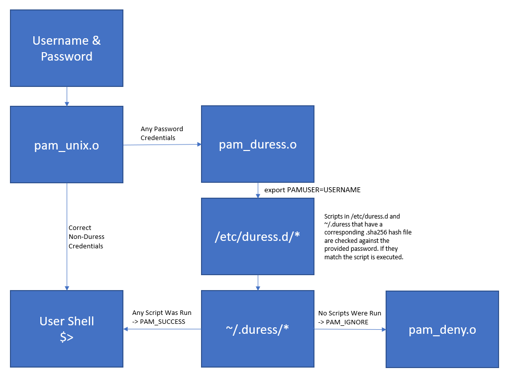

# Intro

The PAM Duress is a module designed to allow users to generate 'duress' passwords that when used in place of their normal password will execute abritrary scripts.

This functionality could be used to allow someone pressed to give a password under coersion to provide a password that grants access but in the background runs scripts to clean up sensitive data, close connections to other networks to limit lateral movement, and/or to send off a notifcation or alert (potentially one with detailed information like location, visible wifi hotspots, a picture from the camera, a link to a stream from the microphone, etc). You could even spawn a process to remove the pam_duress module so the threat actor won't be able to see if the duress module was available.

This is transparent to the person coersing the password from the user as the duress password will grant authentication and drop to the user's shell.

Duress scripts can be generated on an individual user basis or generated globally. Users can also re-use global duress passwords to sign their own duress scripts (rare instance where this could actually be useful from a security perspective).

Contributions to this project are more than welcome; refer to our guidance on making contributions [here](docs/Contributing.md).

## Requirements

```bash
# Ubuntu/Debian dependencies
sudo apt-get install build-essential libpam0g-dev libssl-dev
```

## Build

```bash
make
sudo make install
make clean
# make uninstall
```

## Configuration

Configuration of the duress module is split into two different configuration directories. After installation, you'll need to manually create both of them.

```bash
mkdir -p ~/.duress # Local duress scripts/binaries.
mkdir -p /etc/duress.d  # Global Duress scripts/binaries.
```

After creating the directories you can create scripts, compile binaries, etc and put them in these directories. To assign a password to execute a particular script you use the duress_sign to create a combination password hash and integrity hash for the script.

```bash
$> duress_sign ~/.duress/delete_workspace.sh
Password: 
Confirm: 
Reading /home/user/.duress/delete_workspace.sh, 33...
Done
6B8B621EFB8050B83AAC734D56BF9165DC55D709CBAD530C6241E8A352587B3F
$> chmod -R 500 ~/.duress
$> ls -al ~/.duress/
drwxr-xr-x 2 user user 4096 Aug 20 15:15 .
drwxr-xr-x 8 user user 4096 Aug 20 15:11 ..
-r-x------ 1 user user   33 Aug 20 15:11 delete_workspace.sh
-r-x------ 1 user user   32 Aug 20 21:49 delete_workspace.sh.sha256
```

**NOTE:** Scripts will only execute with permission masks of 500, 540, 550, 700 or 750

**NOTE:** User generated duress scripts are only run when they attempt to log in AND use a duress password that one of their scripts is signed with. If user Jill signs their scripts with the same password as a global script, when they use it the global scripts will run, followed by Jill's duress scripts, but Bob, Jane, or Dan's scripts will not be run even if they also re-used the same duress scripts.

## PAM Configuration

Modify /etc/pam.d/common-auth from the following defaults:
```bash
auth    [success=1 default=ignore]      pam_unix.so

auth    requisite                       pam_deny.so
```

To the below:

```bash
# Example /etc/pam.d/common-auth
auth    [success=2 default=ignore]      pam_unix.so
auth    [success=1 default=ignore]      pam_duress.o

auth    requisite                       pam_deny.so
```

### Order of Operations Normal Password
 - User enters their standard username and password.
 - pam_unix.o confirms them and returns PAM_SUCESS and skips 2 past pam_deny.o.

### Order of Operations Duress Password
 - The pam_unix.o module first checks standard username and password, but since the duress password is not the users actuall password it fails resulting in a default behavior of 'ignore' per the configuration.
 - PAM then applies the username/password to pam_duress.o which:
   - Enumerates files in /etc/duress.d/
   - Checks for files that have matching .sha256 extensions
   - Hashes the provided password salted with the sha256 hash of the file and compares it with the one stored in the .sha256 extension file
   - If the hashes match, the script is executed via:
     - `export PAMUSER=[USERNAME]; /bin/sh [FILE]`
     - NOTE: PAMUSER is set so global duress scripts can specify the account flagging durress.
   - Process is repeated for all files in ~/.duress/ for the user attempting to log in.
   - Finally if ANY script is run, PAM_SUCCESS is return. Otherwise PAM_IGNORE is returned.
 - If PAM_SUCESS is returned PAM will skip 1 and move past pam_deny.o to continue the pam module processes, eventually dropping to an authenticated shell. Otherwise the default 'ignore' behavior is honored moving to pam_deny.o, resulting in a failed authentication.



## Testing

It is easy to do a quick test to ensure the duress module is working properly.

```bash
$> mkdir -p ~/.duress
$> echo 'echo "Hello World"' > ~/.duress/hello.sh
$> duress_sign ~/.duress/hello.sh
Password: # Enter a duress password that is NOT your actual password.
Confirm: 
$> chmod 500 ~/.duress/hello.sh
$> chmod 400 ~/.duress/hello.sh.sha256
$> sudo pam_test $USER
Credentials accepted.
Password: # Enter the password you signed the hello.sh script with.
Hello World # This output is from the duress script...
Account is valid. # ...and we still got a valid authentication.
Authenticated
$> sudo pam_test $USER
Credentials accepted.
Password: # Now enter your actual password.
Account is valid. # Note, Hello World doesn't print.
Authenticated
```

## Example Implementations

 - [Use Pushover to Notify IT You're Under Duress](docs/examples/Pushover.md)
